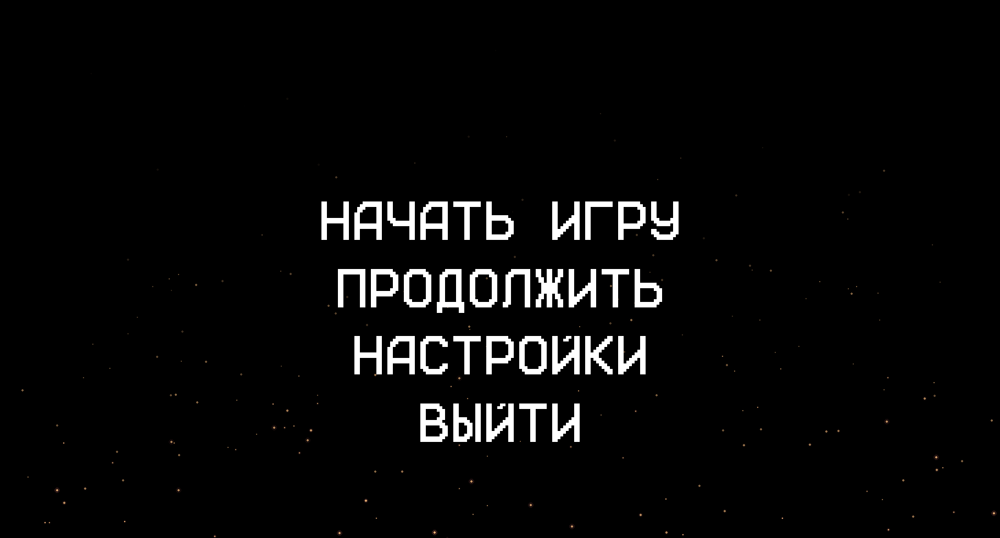

# Slack

## Тот самый динамичный платформер с сюжетом

Slack - сюжетный платформер с упором на динамику, мир которого крутится вокруг персонажа, пришедшего на вечеринку раньше времени. Чем же скрасить время, пока никто не пришёл?

(Место под скриншоты)




## Аналоги

Схожие проекты от других разработчиков, вдохновившие нас на создание данного

**Hotline Miami**:
- [Официальный сайт](https://www.hotlinemiami.com/)
- 

**Продукт-конкурент 2**:
- [Официальный сайт](https://www.veewo.com/neonabyss)
- 


## Системные требования

**Минимальные системные требования**:
- OS: Windows 10, MacOS 10.9, Linux
- ОЗУ: 4 Гб
- Свободное место на диске: 1 Гб
- Процессор: 1 ГГц
- Видеоадаптер: совместимый с «DirectX 9»

**Рекомендуемые системные требования**:
- OS: Windows 10 и выше, MacOS 10.9 и выше, Linux
- ОЗУ: 4 Гб и более
- Свободное место на диске: 1 Гб и более
- Процессор: 2 ГГц и более
- Видеоадаптер: 1 Гб видеопамяти и более


**Технологический стек**:
- ЯП: Python
- Библиотеки/модули: PyGame
- Программы: PyCharm Community Edition, Aseprite, FL Studio 21

## Порядок запуска приложения

Для запуска продукта необходимо скачать готовый билд с вкладки релизов ИЛИ собрать его самостоятельно, используя команду:

```cmd
pyinstaller --onefile --noconsole main.py
```

## TODO:
**Техническое:**
- [x] Создать README
- [x] Полностью заполнить README
- [X] Создать инициализацию приложения
- [X] Создание главного меню
- [X] Сделать режим разработчика (Для удобства тестирования функций)
- [X] Создать основные механики игрока
- [X] Прописать логику игрового UI (ХП, комбо, эффекты и тп)
- [X] Создать первого врага
- [X] Создать первое оружие
- [X] Создать логику карты
- [X] Создать автосохранения и связать игру с БД
- [X] Реализовать логику звука (реакция на действия игрока, динамичная смена треков и тп)

**Творческое:**
- [X] Доделать музыкальное сопровождение
- [ ] Сделать официальный релиз саундтреков (в связи со сроками диструбуции, на площадках появятся скорее всего уже после полного релиза игры)
- [X] Создать спрайты основные спрайты персонажа
- [X] Создать спрайты врагов
- [X] Нарисовать первый уровень

## Ресурсы

### Музыка:

- [Main Theme](https://vk.com/artist/gmex)
- [Another Winter Day](https://vk.com/artist/gmex)
- [The Darkish Feeling](https://vk.com/artist/gmex)

### Звуки:
- [Звуки шагов](https://dryoma.itch.io/footsteps-sounds)

Все ресурсы, за исключением звуков шагов, были сделаны самостоятельно :)

## Авторы проекта

### Ефимов Максим Александрович (aka GmeX)
Тимлид проекта, основной координатор по вопросам как техническим, так и сюжетным. Кодер, оптимизатор, композитор и звукорежиссёр
### Греков Иван Сергеевич (aka Maneko)
Основной кодер, обладающий наибольшими практическими знаниями в области создания игр. Фиксер, главный сценарист проекта

## Отдельное спасибо

### Любич Андрей Михайлович (aka Splaw74)
Главный и единственный дизайнер проекта, создавший все спрайты в игре
